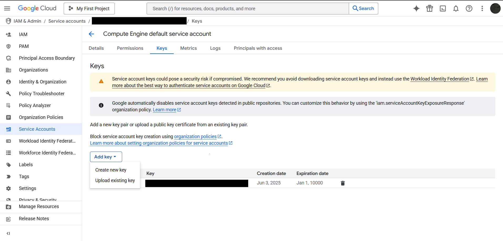
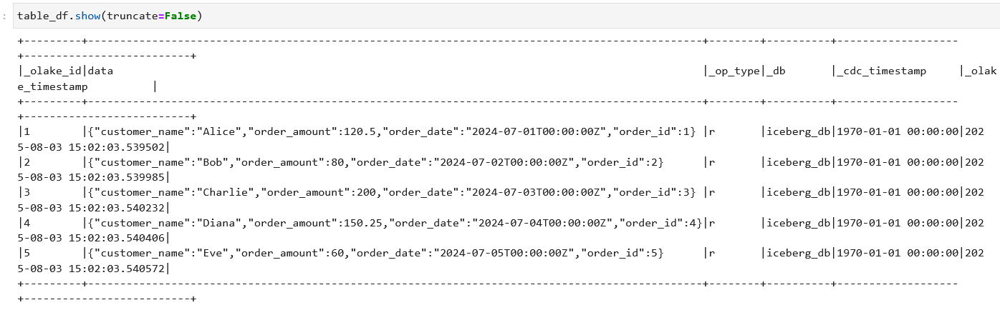

## OLake PostgreSQL to Google Cloud Storage via Lakekeeper
This guide demonstrates syncing data from a PostgreSQL source (filess.io or any managed database) to Google Cloud Storage in Iceberg format using OLake and Lakekeeper, then querying with Spark on Dataproc.

---

### 1. Insert Data into filess.io PostgreSQL using Python

Use the provided `sql_insert.py` script to connect to your filess.io Postgres instance, create a schema/table, and insert sample records.

**Prerequisites**: Python 3.7+, `psycopg2-binary` package

**Steps:**

1. (Recommended) Create a Python virtual environment:
   ```bash
   python -m venv venv
   ```
2. Activate the environment:
   - On Windows:
     ```bash
     .\venv\Scripts\activate
     ```
   - On macOS/Linux:
     ```bash
     source venv/bin/activate
     ```
3. Install dependencies:
   ```bash
   pip install psycopg2
   ```
4. Open `sql_insert.py` in your editor.
5. Update the following variables with your database details:
   - `hostname` – your database server address
   - `database` – your database name
   - `port` – your database port (e.g., 5433)
   - `username` – your database username
   - `password` – your database password
6. Save the file.
7. Run the script from your terminal:
   ```bash
   python sql_insert.py
   ```
This will:
- Connect to your Postgres database
- Create the `ecommerce` schema and `orders` table (if not present)
- Insert sample records
- Print the inserted data

---

### 2. Configure OLake

- Create `source.json` with your Postgres connection details. Example:

```json
{
  "host": "<your_postgres_host>",
  "port": "<your_postgres_port>",
  "username": "<your_postgres_username>",
  "password": "<your_postgres_password>",
  "database": "<your_postgres_db>",
  "default_mode": "cdc",
  "max_threads": 2
}
```

- Create `destination.json` with your Iceberg/Rest Catalog and GCS configuration. Example:
  (For GCP/Azure, see also https://olake.io/docs/writers/iceberg/azure)

```json
{
  "type": "ICEBERG",
  "writer": {
    "catalog_type": "rest",
    "rest_catalog_url": "http://host.docker.internal:8181/catalog",
    "iceberg_s3_path": "olake_warehouse",
    "iceberg_db": "iceberg_db",
    "s3_endpoint": "https://storage.googleapis.com",
    "aws_access_key": "",
    "aws_secret_key": "",
    "aws_region": "",
    "no_identifier_fields": true
  }
}
```

---

### 3. Check the Connection

Before proceeding, check that your configuration files are valid and the connection works:

```bash
docker run --rm \
  -v "/absolute/path/to/config:/mnt/config" \
  olakego/source-postgres:latest \
  check \
  --config /mnt/config/source.json \
  --catalog /mnt/config/streams.json \
  --destination /mnt/config/destination.json
```

---

### 4. Discover Schema

This step will discover the schema from your Postgres source and generate the `streams.json` file.

```bash
docker run --rm \
  -v "/absolute/path/to/config:/mnt/config" \
  olakego/source-postgres:latest \
  discover \
  --config /mnt/config/source.json \
  --catalog /mnt/config/streams.json \
  --destination /mnt/config/destination.json
```

---

### 5. Set Up Lakekeeper for Google Cloud Storage

Direct sync to GCS is not supported, so Lakekeeper is used as an intermediary.

1. Clone the Lakekeeper repository and start the service:
   ```bash
   git clone https://github.com/lakekeeper/lakekeeper
   cd lakekeeper/docker-compose
   docker compose up -d
   ```
2. Create a Google Cloud Storage account and a service account with the necessary permissions.
3. In GCP Console: IAM → Service Accounts → Create Service Account → Manage Keys → Create Key (JSON) → Download and save the key.
[text](readme.md) 
4. Go to [Lakekeeper UI](http://localhost:8181/ui/warehouse), select GCS, and upload your service account key (as file or paste JSON).

5. If you encounter errors, ensure your service account has sufficient permissions related to goggle cloud storage.

---

### 6. Update the `destination.json`, if required

### 7. Sync Data to Google Cloud Storage (via Lakekeeper)

```bash
docker run --rm \
  -v "/absolute/path/to/config:/mnt/config" \
  olakego/source-postgres:latest \
  sync \
  --config /mnt/config/source.json \
  --catalog /mnt/config/streams.json \
  --destination /mnt/config/destination.json
```

---

### 8. Query Data with Spark on GCP Dataproc

1. Create a Dataproc cluster with JupyterLab enabled.
2. Open JupyterLab and start a PySpark or Spark SQL session.

#### Example: Create Spark Session in PySpark

```python
from pyspark.sql import SparkSession

spark = SparkSession.builder \
    .appName("IcebergQuery") \
    .getOrCreate()

# Query the Iceberg table
df = spark.sql("SELECT * FROM rest.<database>.orders")
df.show()
```
