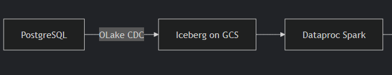

## OLake PostgreSQL to Google Cloud Storage via Lakekeeper
This guide demonstrates syncing data from a PostgreSQL source (filess.io or any managed database) to Google Cloud Storage in Iceberg format using OLake and Lakekeeper, then querying with Spark on Dataproc.

---



### 1. Insert Data into filess.io PostgreSQL using Python

Use the provided `sql_insert.py` script to connect to your filess.io Postgres instance, create a schema/table, and insert sample records.

**Prerequisites**: Python 3.7+, `psycopg2-binary` package

**Steps:**

1. (Recommended) Create a Python virtual environment:
   ```bash
   python -m venv venv
   ```
2. Activate the environment:
   - On Windows:
     ```bash
     .\venv\Scripts\activate
     ```
   - On macOS/Linux:
     ```bash
     source venv/bin/activate
     ```
3. Install dependencies:
   ```bash
   pip install psycopg2
   ```
4. Open `sql_insert.py` in your editor.
5. Update the following variables with your database details:
   - `hostname` – your database server address
   - `database` – your database name
   - `port` – your database port (e.g., 5433)
   - `username` – your database username
   - `password` – your database password
6. Save the file.
7. Run the script from your terminal:
   ```bash
   python sql_insert.py
   ```
This will:
- Connect to your Postgres database
- Create the `ecommerce` schema and `orders` table (if not present)
- Insert sample records
- Print the inserted data

---

### 2. Configure OLake

- Create `source.json` with your Postgres connection details. Example:

```json
{
  "host": "<your_postgres_host>",
  "port": "<your_postgres_port>",
  "username": "<your_postgres_username>",
  "password": "<your_postgres_password>",
  "database": "<your_postgres_db>",
  "default_mode": "cdc",
  "max_threads": 2
}
```

- Create `destination.json` with your Iceberg/Rest Catalog and GCS/Azure configuration.
  (For refrence https://olake.io/docs/writers/iceberg/azure)

```json
{
  "type": "ICEBERG",
  "writer": {
    "catalog_type": "rest",
    "rest_catalog_url": "http://host.docker.internal:8181/catalog",
    "iceberg_s3_path": "olake_warehouse",
    "iceberg_db": "iceberg_db",
    "s3_endpoint": "https://storage.googleapis.com",
    "aws_access_key": "", //leave empty for lakehouse
    "aws_secret_key": "", //leave empty for lakehouse
    "aws_region": "",     //leave empty for lakehouse
    "no_identifier_fields": true
  }
}
```

---

### 4. Discover Schema

This step will discover the schema from your Postgres source and generate the `streams.json` file.

```bash
docker run --rm \
  -v "/absolute/path/to/config:/mnt/config" \
  olakego/source-postgres:latest \
  discover \
  --config /mnt/config/source.json \
  --catalog /mnt/config/streams.json \
  --destination /mnt/config/destination.json
```

---

### 5. Set Up Lakekeeper for Google Cloud Storage

Direct syncing to GCS is not supported, so Lakekeeper acts as an intermediary.

1. Clone the Lakekeeper repository and start the service:
   ```bash
   git clone https://github.com/lakekeeper/lakekeeper
   cd lakekeeper/docker-compose
   ```
2. Before running `docker compose up`, open the `docker-compose.yaml` file and add:
   ```bash
   LAKEKEEPER__ENABLE_GCP_SYSTEM_CREDENTIALS=true
   ```
3. Start the services:
   ```bash
   docker compose up
   ```
4. After the services are running, open [http://localhost:8181](http://localhost:8181) in your browser. Add a warehouse by providing the warehouse name, bucket name, and your GCP service account key (you can generate this key in the GCP Console).
5. In Google Cloud Console, go to IAM → Service Accounts, create a new service account, then go to Manage Keys → Create Key (JSON), and download the key file.
   
6. In the Lakekeeper UI ([http://localhost:8181/ui/warehouse](http://localhost:8181/ui/warehouse)), select GCS and upload your service account key (either as a file or by pasting the JSON).
   
7. If you encounter errors, ensure your service account has the necessary permissions for Google Cloud Storage.
8. To make Lakekeeper accessible from your Dataproc cluster, download ngrok and run:
   ```
   ngrok 8181
   ```
   This will expose your local Lakekeeper service to the public internet so it can be accessed by Dataproc for running Spark jobs.

---

### 6. Update the `destination.json`, if required

### 7. Sync Data to Google Cloud Storage (via Lakekeeper)

```bash
docker run --rm \
  -v "/absolute/path/to/config:/mnt/config" \
  olakego/source-postgres:latest \
  sync \
  --config /mnt/config/source.json \
  --catalog /mnt/config/streams.json \
  --destination /mnt/config/destination.json
```

---

### 8. Query Data with Spark on GCP Dataproc

1. Create a Dataproc cluster with JupyterLab enabled.
2. open the terminal

run 
```bash
pyspark --jars /lib/spark/jars/iceberg-spark-runtime-3.5_2.12-1.9.2.jar,/lib/spark/jars/gcs-connector-hadoop3-2.2.5-shaded.jar 
```
then run 
```bash 
from pyspark.sql import SparkSession

spark = SparkSession.builder \
    .appName("IcebergReadRESTCatalog") \
    .config("spark.sql.extensions", "org.apache.iceberg.spark.extensions.IcebergSparkSessionExtensions") \
    .config("spark.sql.catalog.spark_catalog", "org.apache.iceberg.spark.SparkCatalog") \
    .config("spark.sql.catalog.spark_catalog.type", "rest") \
    .config("spark.sql.catalog.spark_catalog.uri", "<ngrok url>/catalog") \
    .config("spark.sql.catalog.spark_catalog.warehouse", "olake_warehouse") \
    .config("spark.sql.catalog.spark_catalog.io-impl", "org.apache.iceberg.hadoop.HadoopFileIO") \
    .getOrCreate()

spark.sql("SHOW NAMESPACES IN spark_catalog").show()
spark.sql("SHOW TABLES IN spark_catalog.iceberg_db").show()
spark.sql("SELECT * FROM spark_catalog.iceberg_db.orders").show()
```


