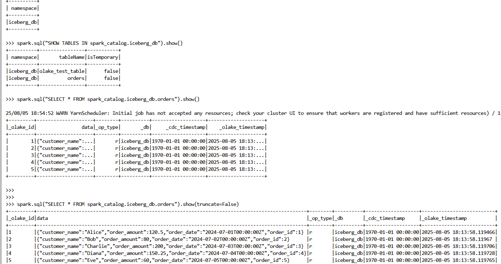

# OLake: Sync PostgreSQL to Google Cloud Storage (Iceberg) via Lakekeeper

This guide walks you through syncing data from a PostgreSQL database (e.g., filess.io or any managed Postgres) to Google Cloud Storage (GCS) in Iceberg format using OLake and Lakekeeper, and then querying it with Spark on Dataproc.

---


## 1. Insert Sample Data into PostgreSQL

Use the provided `sql_insert.py` script to create a schema/table and insert sample records.

**Prerequisites:**
- Python 3.7+
- `psycopg2-binary` package

**Steps:**
1. (Optional) Create and activate a Python virtual environment:
    - Windows:
      ```bash
      python -m venv venv
      .\venv\Scripts\activate
      ```
    - macOS/Linux:
      ```bash
      python3 -m venv venv
      source venv/bin/activate
      ```
2. Install dependencies:
    ```bash
    pip install psycopg2-binary
    ```
3. Edit `sql_insert.py` and update:
    - `hostname`
    - `database`
    - `port`
    - `username`
    - `password`
4. Run the script:
    ```bash
    python sql_insert.py
    ```
   This will:
   - Connect to your Postgres database
   - Create the `ecommerce` schema and `orders` table (if not present)
   - Insert sample records
   - Print the inserted data

---

## 2. Configure OLake

Create configuration files in your project directory.

**`source.json`** (Postgres connection):
```json
{
  "host": "<your_postgres_host>",
  "port": "<your_postgres_port>",
  "username": "<your_postgres_username>",
  "password": "<your_postgres_password>",
  "database": "<your_postgres_db>",
  "default_mode": "cdc",
  "max_threads": 2
}
```

**`destination.json`** (Iceberg/REST Catalog + GCS):
```json
{
  "type": "ICEBERG",
  "writer": {
    "catalog_type": "rest",
    "rest_catalog_url": "http://host.docker.internal:8181/catalog",
    "iceberg_s3_path": "olake_warehouse",
    "iceberg_db": "iceberg_db",
    "s3_endpoint": "https://storage.googleapis.com",
    "aws_access_key": "",
    "aws_secret_key": "",
    "aws_region": "",
    "no_identifier_fields": true
  }
}
```
> For more details, see [OLake Iceberg Writer Docs](https://olake.io/docs/writers/iceberg/azure).

---

## 3. Discover Schema

Generate the `streams.json` file by discovering the schema from your Postgres source.

```bash
docker run --rm \
  -v "/absolute/path/to/config:/mnt/config" \
  olakego/source-postgres:latest \
  discover \
  --config /mnt/config/source.json
```

**(Optional) Test the connection:**
```bash
docker run --rm \
  -v "/absolute/path/to/config:/mnt/config" \
  olakego/source-postgres:latest \
  check \
  --config /mnt/config/source.json
```

---

## 4. Set Up Lakekeeper for Google Cloud Storage

Direct syncing to GCS is not supported; Lakekeeper acts as an intermediary.

1. Clone and start Lakekeeper:
    ```bash
    git clone https://github.com/lakekeeper/lakekeeper
    cd lakekeeper/docker-compose
    ```
2. In `docker-compose.yaml`, add:
    ```yaml
    LAKEKEEPER__ENABLE_GCP_SYSTEM_CREDENTIALS=true
    ```
3. Start Lakekeeper:
    ```bash
    docker compose up
    ```
4. Open [http://localhost:8181](http://localhost:8181) and add a warehouse:
    - Provide warehouse name, bucket name, and upload your GCP service account key (JSON).
5. In Google Cloud Console:
    - Go to IAM → Service Accounts
    - Create a new service account
    - Go to Manage Keys → Create Key (JSON), download the key
    - Ensure the account has GCS permissions
6. In Lakekeeper UI ([http://localhost:8181/ui/warehouse](http://localhost:8181/ui/warehouse)), select GCS and upload the key.
7. (Optional) To expose Lakekeeper to Dataproc, run:
    ```bash
    ngrok 8181
    ```
    Use the generated ngrok URL for remote access.

---

## 5. Update `destination.json` if Needed

Ensure the configuration matches your Lakekeeper and GCS setup.

---

## 6. Sync Data to Google Cloud Storage (via Lakekeeper)

```bash
docker run --rm \
  -v "/absolute/path/to/config:/mnt/config" \
  olakego/source-postgres:latest \
  sync \
  --config /mnt/config/source.json \
  --catalog /mnt/config/streams.json \
  --destination /mnt/config/destination.json
```

---

## 7. Query Data with Spark on GCP Dataproc

1. Create a Dataproc cluster with JupyterLab enabled.
2. Open a terminal and start PySpark with required jars:
    ```bash
    pyspark --jars /lib/spark/jars/iceberg-spark-runtime-3.5_2.12-1.9.2.jar,/lib/spark/jars/gcs-connector-hadoop3-2.2.5-shaded.jar
    ```
3. In PySpark, run:
    ```python
    from pyspark.sql import SparkSession

    spark = SparkSession.builder \
        .appName("IcebergReadRESTCatalog") \
        .config("spark.sql.extensions", "org.apache.iceberg.spark.extensions.IcebergSparkSessionExtensions") \
        .config("spark.sql.catalog.spark_catalog", "org.apache.iceberg.spark.SparkCatalog") \
        .config("spark.sql.catalog.spark_catalog.type", "rest") \
        .config("spark.sql.catalog.spark_catalog.uri", "<ngrok url>/catalog") \
        .config("spark.sql.catalog.spark_catalog.warehouse", "olake_warehouse") \
        .config("spark.sql.catalog.spark_catalog.io-impl", "org.apache.iceberg.hadoop.HadoopFileIO") \
        .getOrCreate()

    spark.sql("SHOW NAMESPACES IN spark_catalog").show()
    spark.sql("SHOW TABLES IN spark_catalog.iceberg_db").show()
    spark.sql("SELECT * FROM spark_catalog.iceberg_db.orders").show()
    ```


